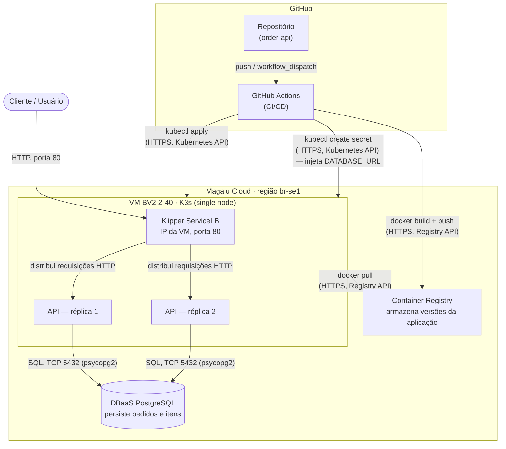

# Arquitetura da solução

## Componentes

| Componente | Serviço MGC | Função |
|---|---|---|
| API | K3s (VM single node) — 2 réplicas | Processa as requisições HTTP |
| Banco de dados | DBaaS PostgreSQL | Persiste pedidos e itens |
| Imagens | Container Registry | Armazena versões da aplicação |
| Tráfego externo | Klipper ServiceLB (IP da VM, porta 80) | Distribui entre as réplicas e fornece acesso externo |
| CI/CD | GitHub Actions | Automatiza testes, build e deploy |

## Fluxo

1. **Deploy**: um push (ou disparo manual) no GitHub aciona o GitHub Actions, que roda os testes, builda a imagem, faz `docker push` para o Container Registry e aplica os manifestos no cluster via `kubectl apply` (usando o kubeconfig da VM K3s). A `DATABASE_URL` é injetada como Secret do Kubernetes nesse mesmo passo, nunca commitada no repositório.
2. **Runtime**: o K3s na VM puxa a imagem do Container Registry e sobe as 2 réplicas da API. O Klipper ServiceLB expõe a porta 80 no IP da própria VM e distribui as requisições entre as réplicas.
3. **Persistência**: cada réplica da API conecta diretamente ao DBaaS PostgreSQL (serviço gerenciado da MGC, externo à VM) via SQL/TCP na porta 5432.

## Requisitos não-funcionais

Números, não adjetivos. Todos mensuráveis a partir do `/metrics` (exposto pelo
`prometheus-fastapi-instrumentator`) e do Klipper ServiceLB/probes do K8s.

| Requisito | Como medir | Alvo |
|---|---|---|
| Disponibilidade | Erros 5xx e uptime das probes (`livenessProbe`/`readinessProbe` em `/health`) no Grafana | 99,5% mensal (≈ 3h39min de indisponibilidade/mês) |
| Latência | `histogram_quantile(0.95, sum(rate(http_request_duration_seconds_bucket[5m])) by (le))` do `/metrics` | P95 < 500 ms |
| Escalabilidade | Teste de carga (k6) + `rate(http_requests_total[1m])` | 300 req/s sem degradar (P95 se mantém < 500 ms e taxa de erro 5xx < 1%) |
| Custo | VM + DBaaS + IP na calculadora MGC | Teto definido em ADR |

### Detalhamento

**Disponibilidade — 99,5% mensal**
- Medido como `1 - (minutos com probe falhando ou retornando 5xx / minutos no mês)`.
- Com 2 réplicas atrás do Klipper ServiceLB, uma falha de pod isolada não deve contar
  como indisponibilidade — só conta se **ambas** as réplicas estiverem fora ao mesmo tempo,
  ou se o `/health` reportar `database: unavailable`.
- 99,5% mensal permite ~3h39min de indisponibilidade acumulada por mês — folga suficiente
  pra rolling updates e reinícios pontuais do K3s single-node, sem exigir HA de VM (que
  esse desenho não tem: é um único nó).

**Latência — P95 < 500 ms**
- Query Prometheus: `histogram_quantile(0.95, sum(rate(http_request_duration_seconds_bucket[5m])) by (le, handler))`.
- Medido por rota (`handler`), não agregado — `POST /orders/{id}/items` e `GET /orders`
  têm perfis de latência diferentes; agregar tudo esconde regressões em uma rota específica.
- 500 ms é alvo de p95 sob carga normal, não pico; ver escalabilidade abaixo para o
  comportamento sob 300 req/s.

**Escalabilidade — 300 req/s sem degradar**
- Script k6 com ramp-up gradual até 300 req/s sustentado por pelo menos 5 minutos,
  distribuído entre os endpoints principais (`POST /orders`, `POST /orders/{id}/items`,
  `GET /orders/{id}`) na proporção esperada de uso real.
- "Sem degradar" = durante o teste, P95 continua < 500 ms **e** taxa de erro 5xx < 1%
  **e** `rate(http_requests_total[1m])` acompanha a carga gerada (sem fila crescendo,
  sinal de saturação).
- Como é VM single-node, o teto real de RPS é limitado pelo `machine_type` da VM
  (BV2-2-40) e pelo DBaaS — o k6 também deve reportar em que ponto (se houver) a
  aplicação para de acompanhar a carga, para orientar decisão de subir o tipo de
  máquina ou o plano do banco antes de precisar de fato.

**Custo — teto definido em ADR**
- Composição: VM (BV2-2-40) + DBaaS PostgreSQL (plano definido) + IP público (Klipper
  usa o IP da própria VM, sem custo adicional de LoadBalancer) + Container Registry.
- Valores tirados da calculadora oficial da MGC (https://docs.magalu.cloud/) no momento
  do dimensionamento; o teto e a justificativa de cada item ficam registrados em ADR
  separado (`docs/adr/`), não neste documento — arquitetura descreve o "o quê", o ADR
  registra o "por quê" e o valor aprovado, que muda com mais frequência que o desenho.

## Estilo arquitetural

**Atual: monolito em camadas**, implantado como container único com duas réplicas.

A aplicação é um único processo/imagem contendo três camadas internas — apresentação
(`app/api`, os routers HTTP), serviço (`app/services`, regra de negócio) e dados
(`app/repositories` + `app/models`, acesso ao PostgreSQL). As camadas são um limite
*lógico* de código (cada uma só conhece a camada abaixo dela), não um limite de
*implantação*: não há rede nem serialização entre elas, tudo roda no mesmo processo
Python, replicado horizontalmente (2 réplicas) atrás do Klipper ServiceLB para
disponibilidade e throughput.

Esse estilo é a escolha certa agora: um domínio só (pedidos), um time só, sem necessidade
de escalar partes da aplicação de forma independente. Monolito em camadas troca
flexibilidade de escala granular por simplicidade operacional — um único deploy, um único
banco, um único conjunto de logs/métricas — o que é exatamente o trade-off que faz sentido
no estágio atual do projeto.

**Estilo-alvo, se o domínio de notificações crescer:** extrair um segundo serviço.

O gatilho não é "crescer" em volume de requisições (isso o monolito replicado já absorve
— ver Escalabilidade acima) — é o **domínio de notificações ganhar responsabilidades
próprias** (múltiplos canais, templates, retries e filas independentes do fluxo de
pedidos, regras de negócio que não têm relação com `Order`/`Item`). Quando isso acontecer,
a extração seria:

- Um segundo serviço (`notification-service`), com seu próprio deploy, réplicas e,
  possivelmente, seu próprio banco — deixando de compartilhar o schema do `order-api`.
- Comunicação entre os dois via evento (ex.: `order_created`, `order_cancelled`)
  em vez de chamada HTTP síncrona, para o serviço de pedidos não ficar acoplado à
  disponibilidade do serviço de notificações.
- Nesse ponto o estilo muda de monolito em camadas para **arquitetura orientada a
  serviços** (não necessariamente "microsserviços" completo — dois serviços bem
  desenhados já contam) com comunicação assíncrona entre os dois domínios.

Até lá, notificações (se existirem) ficam como mais um módulo dentro do monolito atual —
extrair cedo demais troca a simplicidade de agora por complexidade operacional (dois
deploys, duas bases, mensageria) sem um domínio que justifique o custo.

## Trade-offs

| Aspecto | Decisão tomada | Alternativa não escolhida | Motivo da escolha |
|---|---|---|---|
| Deploy | K3s em VM | MKS (Kubernetes Gerenciado) | Custo menor, provisionamento < 2 min, manifests idênticos |
| Banco | DBaaS gerenciado | PostgreSQL em container | Backup automático, sem administração |
| CI/CD | GitHub Actions | Deploy manual | Consistência e rastreabilidade |
| Réplicas | 2 pods | 1 pod | Disponibilidade mínima sem custo excessivo |
| API | FastAPI (Python) | Node.js, Go, Java | Curva de aprendizado baixa, alta produtividade |

Deploy e Banco estão detalhados nos ADRs 001 e 002 (`docs/adr/`) — contexto,
alternativas e consequências completas ficam lá; aqui é só o resumo comparativo.

## Pontos de melhoria

### Escalabilidade

A aplicação é stateless, então escala na horizontal — mais réplicas atrás do
balanceador. Hoje são 2 réplicas fixas; o próximo passo natural é o **HPA**
(Horizontal Pod Autoscaler), que ajusta esse número automaticamente pela utilização
de CPU (ex.: mínimo 2, máximo 6, alvo de 70%).

Vale registrar também que mais réplicas não resolvem um gargalo de banco — o
PostgreSQL escala na vertical e costuma saturar primeiro. Antes de configurar o HPA,
o teste de carga (k6, ver Requisitos não-funcionais) precisa mostrar *onde* o sistema
degrada sob 300 req/s: se for CPU da API, o HPA resolve; se for o DBaaS, adicionar
réplicas de API só desloca a fila de espera para as conexões do banco.

### Próximos passos naturais

| Melhoria | Por quê |
|---|---|
| HTTPS / TLS | Toda API em produção deve ser acessada por HTTPS |
| Autoscaler (HPA) | Escala automaticamente conforme a carga |
| Versionamento de API | `/v1/orders` permite evoluir sem quebrar clientes |
| Rate limiting | Evita abuso e protege o banco de sobrecargas |
| Cache (Redis) | Reduz consultas repetidas ao banco |
| Migrações de schema (Alembic) | Controle de versão das mudanças no banco |
| Testes de carga | Valida o comportamento sob alto tráfego |
| Migrar para MKS | Quando precisar de HA real: basta trocar o kubeconfig — os manifests YAML são idênticos |

### Custo estimado na Magalu Cloud

| Recurso | Especificação | Observação |
|---|---|---|
| VM K3s | BV2-2-40 (2 vCPU, 2 GB) | Cobrada por hora de uso |
| DBaaS PostgreSQL | Instância pequena | Cobrado por hora de uso |
| Container Registry | Por armazenamento | Baixo para imagens < 500 MB |

Consulte os preços atualizados em: https://magalu.cloud/precos/
