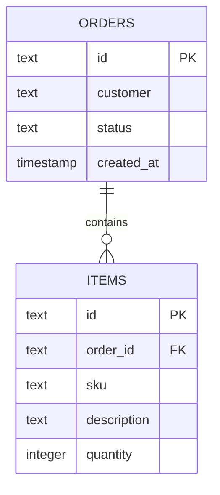

# Modelagem de Dados

Este documento registra a estrutura dos dados da API: tabelas, colunas e relacionamentos, conforme definidos em `app/models/order.py` e `app/models/item.py`.

## Entidades

### Pedido (`orders`)

| Coluna | Tipo | Descrição |
|---|---|---|
| `id` | TEXT (UUID) | Identificador único, gerado automaticamente (`uuid4`) |
| `customer` | TEXT | Nome do cliente |
| `status` | TEXT | Estado do pedido (`open` por padrão, ou `cancelled`) |
| `created_at` | TIMESTAMP (com timezone) | Data e hora de criação, preenchida automaticamente em UTC |

Definida em `app/models/order.py`.

### Item (`items`)

| Coluna | Tipo | Descrição |
|---|---|---|
| `id` | TEXT (UUID) | Identificador único, gerado automaticamente (`uuid4`) |
| `order_id` | TEXT | Chave estrangeira → `orders(id)` |
| `sku` | TEXT | Código do produto |
| `description` | TEXT | Descrição do item |
| `quantity` | INTEGER | Quantidade |

Definida em `app/models/item.py`.

## Relacionamento

Um pedido (`orders`) tem vários itens (`items`): relacionamento **1:N**.

A coluna `order_id` em `items` é a chave estrangeira que liga cada item ao seu pedido. Apagar um pedido apaga automaticamente todos os seus itens (`cascade="all, delete-orphan"`), configurado na relação `Order.items` (`app/models/order.py`).

> Observação: a API atualmente **não expõe uma rota de exclusão física** de pedido — `DELETE /orders/{id}` faz apenas um soft delete, alterando `status` para `cancelled` (ver `services.order_service.cancel_order` e `repositories.order_repository.cancel_order`). O cascade de exclusão descrito acima só é acionado se um registro `Order` for removido diretamente no banco.

## Como as tabelas são criadas

As tabelas são criadas automaticamente pelo SQLAlchemy na inicialização da aplicação, via `Base.metadata.create_all(bind=engine)` em `app/main.py`. Nesse ponto, `app/main.py` importa `Order` e `Item` de `app.models` (que reexporta os dois em `app/models/__init__.py`) só para garantir que as duas classes estejam registradas na `Base` antes do `create_all` — sem esse import, uma tabela referenciada só por relacionamento poderia não ser criada.

As definições de coluna ficam em `app/models/order.py` e `app/models/item.py`; a declaração da `Base` e do `engine` fica em `app/database.py`.

## Quem acessa essas tabelas

Com a separação em camadas, os models não são consultados diretamente pelas rotas:

| Camada | Arquivo | O que faz com `Order`/`Item` |
|---|---|---|
| Repository | `app/repositories/order_repository.py` | Único ponto que executa queries, `commit` e `refresh` contra `orders` e `items` |
| Service | `app/services/order_service.py` | Chama o repository e serializa `Order`/`Item` em dict (`order_to_dict`) para a resposta HTTP |
| API | `app/api/v1/orders.py`, `app/api/v1/health.py` | Não importa `Order`/`Item` diretamente — só chama o service |

Na prática, isso significa que qualquer mudança de schema (nova coluna, nova regra de validação) tende a tocar três arquivos, nessa ordem: o model (`app/models/`), o repository (se a query mudar) e o service (se o formato da resposta mudar) — a camada de API normalmente não precisa mudar.

## Conexão com o banco

A string de conexão é lida da variável de ambiente `DATABASE_URL` (`app/database.py`):

```python
DATABASE_URL = os.getenv("DATABASE_URL", "sqlite:///./orders.db")
```

| Ambiente | Origem da `DATABASE_URL` |
|---|---|
| Local / desenvolvimento | Não definida → fallback para SQLite local (`orders.db`) |
| Kubernetes / produção | Injetada via `secretKeyRef` (`db-secret` → chave `url`), definida em `k8s/app.yaml` |

## Diagrama de relacionamento


