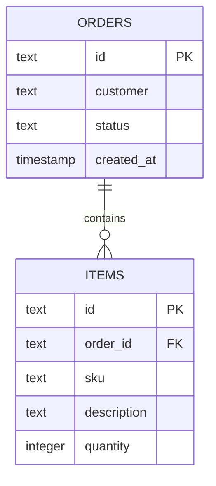

# Modelagem de Dados

Este documento registra a estrutura dos dados da API: tabelas, colunas e relacionamentos, conforme definidos em `app/models.py`.

## Entidades

### Pedido (`orders`)

| Coluna | Tipo | Descrição |
|---|---|---|
| `id` | TEXT (UUID) | Identificador único, gerado automaticamente (`uuid4`) |
| `customer` | TEXT | Nome do cliente |
| `status` | TEXT | Estado do pedido (`open` por padrão, ou `cancelled`) |
| `created_at` | TIMESTAMP (com timezone) | Data e hora de criação, preenchida automaticamente em UTC |

### Item (`items`)

| Coluna | Tipo | Descrição |
|---|---|---|
| `id` | TEXT (UUID) | Identificador único, gerado automaticamente (`uuid4`) |
| `order_id` | TEXT | Chave estrangeira → `orders(id)` |
| `sku` | TEXT | Código do produto |
| `description` | TEXT | Descrição do item |
| `quantity` | INTEGER | Quantidade |

## Relacionamento

Um pedido (`orders`) tem vários itens (`items`): relacionamento **1:N**.

A coluna `order_id` em `items` é a chave estrangeira que liga cada item ao seu pedido. Apagar um pedido apaga automaticamente todos os seus itens (`cascade="all, delete-orphan"`), configurado na relação `Order.items`.

> Observação: a API atualmente **não expõe uma rota de exclusão física** de pedido — `DELETE /orders/{id}` faz apenas um soft delete, alterando `status` para `cancelled`. O cascade de exclusão descrito acima só é acionado se um registro `Order` for removido diretamente no banco.

## Como as tabelas são criadas

As tabelas são criadas automaticamente pelo SQLAlchemy na inicialização da aplicação, via `Base.metadata.create_all(bind=engine)` em `app/main.py`. As definições estão em `app/models.py`.

## Conexão com o banco

A string de conexão é lida da variável de ambiente `DATABASE_URL` (`app/database.py`):

```python
DATABASE_URL = os.getenv("DATABASE_URL", "sqlite:///./orders.db")
```

| Ambiente | Origem da `DATABASE_URL` |
|---|---|
| Local / desenvolvimento | Não definida → fallback para SQLite local (`orders.db`) |
| Kubernetes / produção | Injetada via `secretKeyRef` (`db-secret` → chave `url`), definida em `k8s/app.yaml` |

## Diagrama de relacionamento


